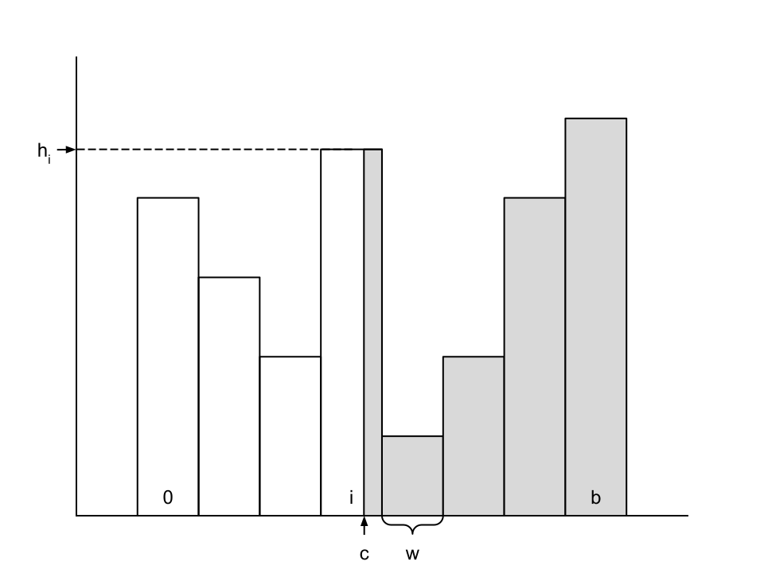

# Programming Assignment 3

In this assignment, you will write a set of operators to implement table projections, selections, joins, and aggregates.
These will provide you with a database system that can perform simple queries over multiple tables.

A complex query may consist of many operators. These operations can be reordered to improve performance. It is important
to be able to estimate the cost of each query plan. Accurate cost estimation enables the query planner to identify and
select the most efficient plan, ensuring better query optimization. In this assignment, you will also develop an
estimator for a simple query planner.

## Projection

The `Project` operator is projecting a subset of fields from the tuples of a file.
Given an input `DbFile`, an output `DbFile`, and a mapping between the fields of the tuple descriptors,
the `Project` operator will insert into the output file all the tuples from the input file, but with only the
specified fields.

## FilterPredicate

A `FilterPredicate` describes a comparison between two numeric fields. The supported operators are `EQUALS`,
`NOT_EQUALS`,
`GREATER_THAN`, `LESS_THAN`, `LESS_THAN_OR_EQ`, and `GREATER_THAN_OR_EQ`.

## Filter

The `filter` operation is used to filter out tuples that do not satisfy a given a collection of `FilterPredicate`
operators. This operator will take in an input `DbFile` and an output `DbFile`, and will insert into the output
file all the tuples from the input file that satisfy all the predicates.

## Aggregate

The `aggregate` operations implement basic SQL aggregates with a GROUP BY clause. You should implement the five SQL
aggregates (`COUNT`, `SUM`, `AVG`, `MIN`, `MAX`) and support grouping. You only need to support aggregates over a single
field, and grouping by a single field. If there is no grouping, the aggregate should return a single tuple with one
field.

## JoinPredicate

A `JoinPredicate` describes a comparison between two fields of two tuples.

## Join

The `join` operation is used for joining tuples from two input files. The join operation will take in two input `DbFile`
objects and an output `DbFile` object. The join operation will insert into the output file all the tuples that are the
result of joining the tuples from the two input files that satisfy the join predicate. If the join predicate operator is
`EQ`, the operation will perform ignore the joining field of the second file (to avoid repetition of equal values).

## Filter Cardinality Estimation

The `ColumnStats` class is used to store statistics about a column in a table. It is based on a histogram of the values
in the column. The histogram is an array of `buckets` integers, where each integer represents the number of values of
the column that fall into a particular range. The ranges are determined by the `min` and `max` values of the column, and
the number of buckets in the histogram. The `min` and `max` values are provided when the `ColumnStats` object is
created, and no values outside of this range will be added to the histogram.

Estimating the size of a selection predicate is a common operation in query optimization. The cardinality of a selection
predicate is the number of tuples that satisfy the predicate. We can use the histogram to make a rough estimation of the
cardinality of a selection predicate as follows:

- Construct a histogram by splitting the [min, max] domain in equally sized `buckets` of length `w`. Each bucket
  representing the number of records in a fixed range of the domain of the attribute of the histogram.
  For example, if a field `f` ranges from 1 to 100, and there are 10 buckets, then bucket 0 would contain the count of
  the number of records between 1 and 10, bucket 1 the count of the number of records between 11 and 20, and so on.
  Note: Keep count of how many elements have been added to the histogram.
- To estimate the cardinality of an equality expression, `f = c`, compute the bucket that contains value `c`.
  Suppose the width (range of values) of the bucket is `w`, the height (number of tuples) is `h`, and the number of
  tuples in the table is `n`. Then, assuming values are uniformly distributed throughout the bucket, the cardinality
  of the expression is roughly `h / w`.
- To estimate the cardinality of a range expression `f > c`, compute the bucket `i` that `c` is in, with width `w` and
  height `h`. Assuming tuples are uniformly distributed throughout bucket `i`, the fraction of the bucket that satisfies
  the predicate is `(r - c) / w`, where `r` is the right endpoint of bucket `i`. In addition, buckets `i+1 ... b`
  contribute all of their cardinality. Summing the cardinality contributions of all the buckets will yield the overall
  cardinality of the expression. The figure illustrates this process.
- Selectivity of expressions involving less than can be performed similar to the greater than case, looking at buckets
  down to 0.

## Questions

1. An ambitious student tries to implement an OR clause by executing two `filter` operations, each with the same input
   and output files, but with different predicates.
   Discuss what is the problem with this approach and how would you fix it.
2. The `aggregate` operation supports grouping by a single field. Discuss how you could extend this to support grouping
   by
   multiple fields. How can you implement the HAVING clause?
3. What is the complexity of your join operation? How could you improve it?
4. Given the cardinality of a selection predicate, can you estimate the IO cost of the query? What other factors would
   you need to consider to estimate the IO cost?
5. In the previous assignment we introduced a join operation. How would you estimate the cardinality of a join between
   two tables based on the histograms of the join columns?
6. A table is stored in a file that consists of 150000 pages. Assume the cardinality of a predicate is 1000, a leaf page
   can fit 50 tuples, and the table is stored in a BTreeFile with 3 levels (root -> internal -> leaf). How many pages
   would you need to read to evaluate the predicate? What if the table was stored in a HeapFile?
